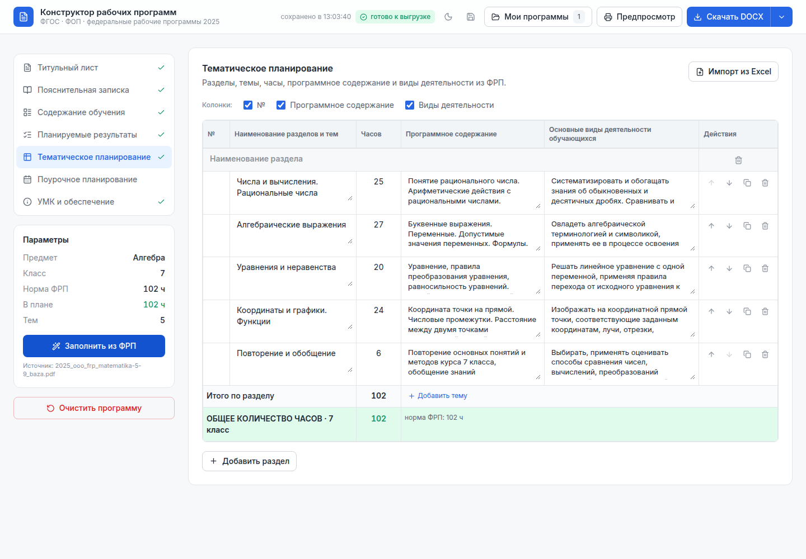
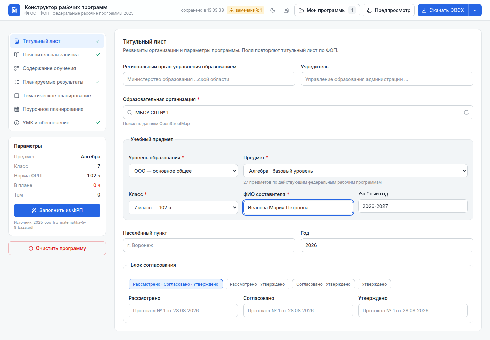
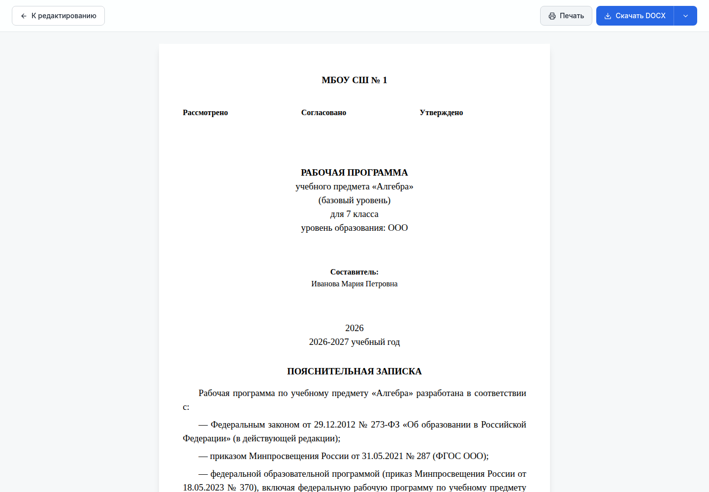
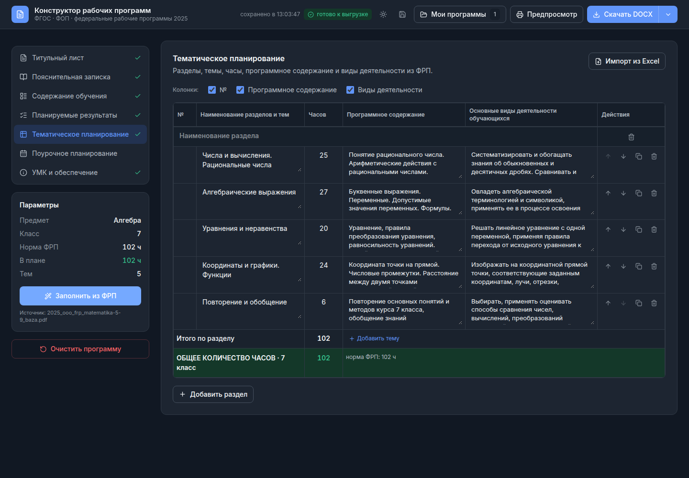
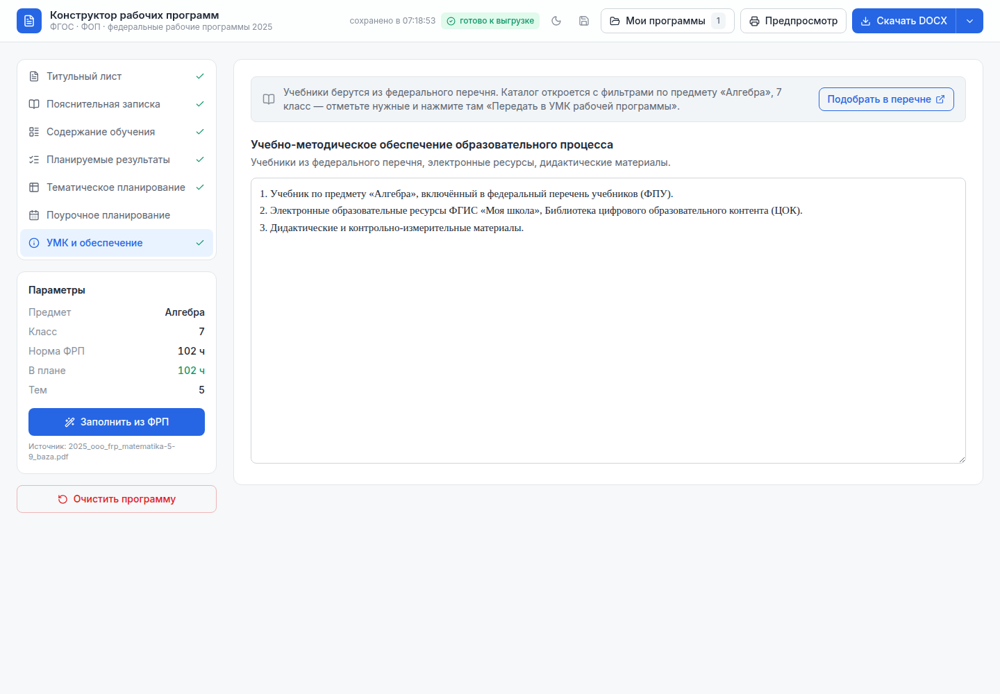
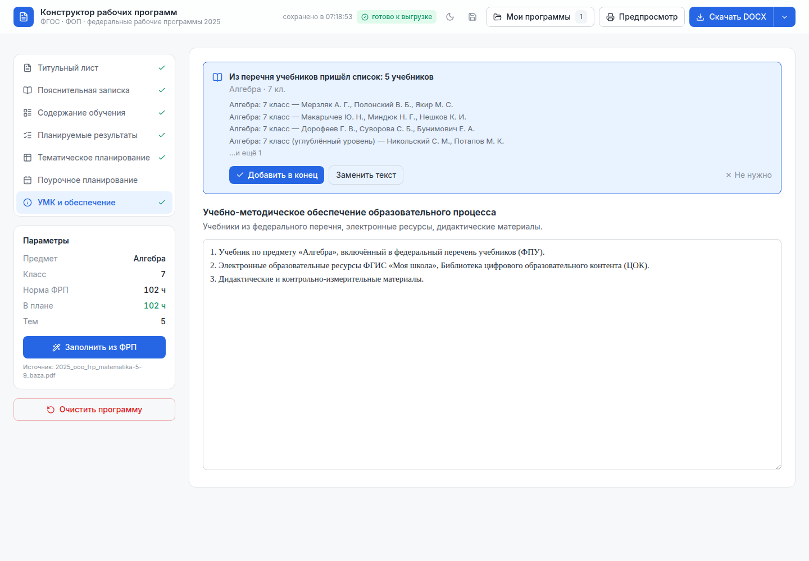

<div align="center">

# Конструктор рабочих программ

**Рабочая программа по предмету — из федеральных программ 2025 года,
в браузере, без регистрации, с выгрузкой в DOCX, ODT, PDF, TXT и Markdown.**

[](https://github.com/Bormotoon/program-constructor/actions/workflows/ci.yml)
[](https://github.com/Bormotoon/program-constructor/actions/workflows/pages.yml)
[](https://github.com/Bormotoon/program-constructor/releases/latest)
[](LICENSE)
[](https://dalink.to/bormotoon)

[**Открыть приложение**](https://bormotoon.github.io/program-constructor/) ·
[Возможности](#чем-отличается-от-оригинала) ·
[Быстрый старт](#быстрый-старт) ·
[Участие в проекте](CONTRIBUTING.md)

**Русский** · [English](README.en.md)

</div>

---

Открытый аналог [конструктора рабочих программ](https://workprogram.edsoo.ru/)
Института стратегии развития образования. Позволяет собрать рабочую программу
по учебному предмету на основе действующих федеральных рабочих программ (ФРП)
и выгрузить её в DOCX, ODT, PDF, TXT или Markdown.

Приложение полностью клиентское: программы хранятся в браузере, серверной
части нет. Ни регистрации, ни учётных записей, ни аналитики — сама программа
никуда не отправляется.

Единственный запрос наружу — подсказка при поиске образовательной организации:
набранное название уходит в [OpenStreetMap Nominatim](https://nominatim.openstreetmap.org/).
Поле подписано, и без него всё работает: название организации можно просто
ввести руками.



## Чем отличается от оригинала

Оригинал требует регистрации и работает только онлайн. Здесь тот же результат
получается локально, а корпус ФРП лежит в репозитории в разобранном виде.

Реализовано то, что составляет суть оригинала:

- выбор предмета из каталога действующих ФРП (уровень образования → предмет →
  класс), включая базовый и углублённый уровни;
- **предзаполненное тематическое планирование** — разделы, темы, часы,
  программное содержание и основные виды деятельности берутся из ФРП;
- **пояснительная записка, содержание обучения и все три группы планируемых
  результатов** подставляются дословно из ФРП: личностные и метапредметные —
  общие для программы, содержание и предметные — для выбранного класса.
  В сборниках курсов (математика 5–9) у алгебры, геометрии и вероятности
  со статистикой своя записка и свои предметные результаты;
- **поурочное планирование**: у 14 программ из 65 оно расписано в самой ФРП и
  берётся оттуда дословно, у остальных разворачивается из тематического;
  если ФРП предлагает несколько вариантов планирования (под конкретный
  учебник и для самостоятельного конструирования у окружающего мира; разная
  недельная нагрузка у русского языка 6 класса) — выбор остаётся за учителем;
- контроль часов: подытоги «Итого по разделу», строка «ОБЩЕЕ КОЛИЧЕСТВО ЧАСОВ
  ПО ПРОГРАММЕ» и сверка с нормой ФРП с подсветкой расхождений;
- **связка с каталогом федерального перечня учебников** — раздел «УМК и
  обеспечение» единственный, для которого в ФРП нет готового текста, и список
  учебников больше не нужно набирать руками ([подробнее](#учебники-из-федерального-перечня));
- настраиваемый блок согласования на титульном листе (четыре сочетания грифов,
  как в оригинале);
- переключение видимости необязательных колонок таблицы;
- перестановка, копирование, добавление и удаление строк;
- предпросмотр, печать и выгрузка по формату ФРП-2025.

Выгрузка идёт в пяти форматах, и все собираются в браузере — сервер не нужен:

| Формат | Зачем |
|---|---|
| DOCX | в нём программу сдают и правят в Word |
| ODT | родной формат LibreOffice, «Р7-Офиса» и «МойОфиса» |
| PDF | готовый к печати файл, который не поедет на чужом компьютере |
| TXT | простой текст: читается без офисного пакета, вставляется куда угодно |
| Markdown | для вики школы и репозиториев — с осмысленным `diff` при правках |

Состав, порядок разделов и ширины колонок у всех пяти берутся из одной модели
(`src/utils/programOutline.ts`), поэтому форматы не могут разойтись: добавленный
раздел появляется сразу везде, а проверка `npm run verify:export` сверяет,
что каждый заголовок дошёл до каждого формата.

<details>
<summary>Ещё снимки экрана</summary>

**Титульный лист и параметры программы**



**Предпросмотр готового документа**



**Тёмная тема**



</details>

## Учебники из федерального перечня

Все текстовые разделы приходят из ФРП дословно — все, кроме одного. «УМК и
обеспечение» федеральная программа не задаёт: приложение подставляет туда
болванку («учебник по предмету, включённый в ФПУ»), а конкретные названия с
авторами учитель раньше набирал руками.

Если рядом на том же домене развёрнут каталог федерального перечня учебников,
эти два приложения ходят друг к другу в обе стороны.

**Туда.** Кнопка «Подобрать в перечне» открывает каталог с уже выставленными
фильтрами по предмету и классу текущей программы.



Предмет передаётся поиском (`q=`), а не точным фильтром: названия в ФРП и ФПУ
совпадают не всегда — «Труд (технология)», «Иностранный (английский) язык», — и
точное совпадение дало бы пустую выдачу.

**Обратно.** Каталог кладёт отобранный список в `localStorage` и открывает
конструктор ссылкой с `#umk`. Конструктор сразу открывается на нужном разделе и
показывает, что пришло: сколько учебников, по каким предметам и классам, первые
четыре названия.



Молча ничего не подменяется — учитель выбирает: вставить, дописать в конец или
отклонить. Список ловится и без перезагрузки: приложение слушает события
`storage` и `focus`, потому что каталог обычно открыт в соседней вкладке.

Непринятая передача живёт сутки: список недельной давности к текущей программе
уже вряд ли относится. Испорченный или чужой JSON отбрасывается молча — это
фоновая проверка, а не повод показывать учителю ошибку.

Обмен идёт через `localStorage` общего домена, а не через сервер: его нет ни у
конструктора, ни у каталога. Наружу по-прежнему ничего не уходит.

> **Каталог — отдельное приложение.** Конструктор ищет его по соседству
> (`../fpu/`). На демонстрационном стенде GitHub Pages соседа нет, и кнопка
> «Подобрать в перечне» там приведёт на 404 — работает это в развёртывании, где
> оба приложения стоят рядом. Всё остальное на демонстрации работает полностью.

## Где хранятся программы

В `localStorage` этого браузера. Список программ лежит отдельно от их
содержимого: чтобы показать перечень из десяти названий, иначе пришлось бы
разобрать пару мегабайт JSON — одна программа с текстами ФРП и поурочным
планом весит сотни килобайт.

Отсюда следуют два ограничения, о которых приложение говорит прямо:

- очистка истории браузера и режим инкогнито стирают программы;
- места в `localStorage` около 5 МБ, то есть примерно на два десятка программ.
  Когда оно кончается, браузер отказывает в записи — приложение показывает
  это полосой с кнопкой «Сохранить в файл», а не теряет работу молча.

Поэтому перенос и резервная копия — файлами: одна программа отдельным JSON,
все разом — одним. Формат читаемый и не требует этого приложения, чтобы его
открыть.

Как всё устроено внутри — в [ARCHITECTURE.md](ARCHITECTURE.md): конвейер разбора
PDF, модель данных, устройство выгрузки, развёртывание, подводные камни и
рецепты типичных изменений.

## Быстрый старт

Нужен [Node.js](https://nodejs.org/) 20.19+ или 22.12+ (требование Vite 8).

```bash
git clone https://github.com/Bormotoon/program-constructor.git
cd program-constructor
npm install
npm run dev
```

Приложение поднимется на `http://localhost:3000`. Данные ФРП уже в
репозитории, поэтому скачивать что-либо ещё не нужно.

Собранная версия — `npm run build`, результат в `dist/`. Backend ей не нужен,
но статический HTTP-сервер нужен: приложение собрано в ES-модули, а из
`file://` браузер их не грузит. `base` относительный, поэтому каталог можно
положить в любой подкаталог сайта — своего домена, GitHub Pages или
`python3 -m http.server` в самом `dist/`. Готовый архив каждой версии лежит в
[релизах](https://github.com/Bormotoon/program-constructor/releases/latest).

## Откуда берутся данные

Источник — официальные ФРП 2025 года с [edsoo.ru](https://edsoo.ru/), файлы
`2025_{noo,ooo,soo}_frp_*.pdf`. Сами PDF и офлайн-копия сайта в репозиторий
**не входят**: это несколько гигабайт чужих документов. В репозитории лежит
результат их разбора — `src/data/frp/`, и приложению нужен только он.

Заново прогонять конвейер нужно, лишь если вы правите сам разбор. Тогда
понадобятся исходные PDF в каталоге `edsoo/` и Python 3.11+:

```bash
python3 -m venv .venv && .venv/bin/pip install pdfplumber

npm run frp:parse    # таблицы: PDF -> build/frp/*.json (десятки минут, возобновляемо)
npm run frp:content  # записка, содержание, результаты (быстро, pdftotext)
npm run frp:lessons  # поурочное планирование (есть у 14 программ)
npm run frp:reparse  # переразбор тех файлов, где разбор дал сбой
npm run frp:build    # -> src/data/frp/*.json + catalog.ts
```

`npm run frp:parse` возобновляемый: уже разобранные файлы пропускаются, так что
прерванный прогон продолжается той же командой.

### Как устроен разбор

Таблицы тематического планирования в ФРП — настоящие таблицы Word с линиями
разметки, поэтому ячейки берутся через `pdfplumber`. Восстанавливать геометрию
по координатам слов не получается: x-координаты колонок плывут от страницы к
странице и различаются даже между классами внутри одного документа.

Основные сложности, которые пришлось учесть (подробности — в комментариях
`tools/frp_parser.py`):

- число колонок в извлечённой таблице непостоянно, поэтому колонка часов
  определяется по содержимому — и **отдельно в каждой строке**: из-за
  объединённых ячеек часы в соседних строках одной таблицы попадают то во
  вторую, то в третью колонку;
- колонка часов не может быть крайней (слева «№», справа текстовые колонки) —
  без этого ограничения у предметов с простой нумерацией разделов («3», а не
  «3.1») за часы принимался номер раздела;
- заголовки разделов оформлены по-разному: «Раздел 1. Текст» в русском языке и
  просто «Физика и её роль в познании окружающего мира» в физике;
- часть документов — сборники самостоятельных курсов: «Математика. 5–9 классы»
  содержит алгебру, геометрию и вероятность со статистикой, и школы пишут по
  ним отдельные рабочие программы, поэтому курсы разделяются;
- ОРКСЭ перечисляет все шесть модулей на выбор (основы православной,
  исламской, буддийской, иудейской культуры, мировых религиозных культур,
  светской этики) по 34 часа каждый, поэтому сумма по таблице законно вшестеро
  превышает годовую норму — школа выбирает один модуль;
- строка итога иногда извлекается без слова «ОБЩЕЕ» — как «КОЛИЧЕСТВО ЧАСОВ».
  Без учёта этого варианта она считалась обычной темой: у истории СОО так
  набегало 136 часов вместо 68;
- перед словом «Итого» иногда прилипает мусор от разметки («.Итого по
  разделу»), и строка снова принималась за тему: у углублённого английского
  СОО так набегало 177 часов вместо 170. Поэтому шаблоны итоговых строк
  допускают короткий небуквенный префикс;
- на отдельных страницах таблица дробится на два-три десятка узких колонок и
  ячейка часов теряется. Если ФРП объявляет итог раздела и без часов осталась
  ровно одна тема, значение восстанавливается вычитанием — однозначно, а не
  подбором;
- маркеры сносок набраны более мелким кеглем и приклеиваются к числам
  («165¹» извлекается как «1651»), поэтому отбрасываются по размеру символа;
- обрывок переносимой строки иногда затекает в колонку «№» и выглядит там как
  заголовок раздела: у испанского НОО так появлялись «разделы» «Рождеством).»
  и «глубиной проникновения», разрывавшие настоящий раздел пополам. Ловится по
  нумерации — заголовок стоит перед первой темой раздела, а тут номера
  продолжали предыдущий («2.1» → «2.2»);
- ОБЗР даёт одну таблицу на два года (8–9 и 10–11) с суммарными 68 часами и
  без разметки по классам. Она делится по годам, но только при точном
  совпадении: границы разделов должны нарезать таблицу на равные годовые
  части. У ОБЗР сумма выходит на 34 ровно на границе модуля № 6, и это
  подтверждает поурочное планирование — там второй год начинается с модуля
  № 7. Иначе таблица остаётся неразделённой.

Разбор проверяет сам себя: в PDF есть строки «Итого по разделу N» и «ОБЩЕЕ
КОЛИЧЕСТВО N», и если сумма разобранных часов с ними не сходится — это видно
в отчёте.

### Расхождения в самих исходниках

Отчёт разделяет ошибки разбора и расхождения в официальных PDF. Вторые
установлены сверкой с исходным текстом — перечень тем в документе не сходится
с итогом, объявленным в нём же:

| Программа | Что в документе |
|---|---|
| История ООО, 5 класс | раздел «Древний мир»: «Итого по разделу 33» при темах на 22 ч; при этом 6+22+20+20 = 68 совпадает с «Общим количеством часов по курсу» там же |
| История СОО, 11 класс | раздел «СССР в 1945–1991 гг.»: «Итого по разделу 27» при темах 1.1–1.6 на 4+7+8+5+1+1 = 26 ч; итог класса 68 сходится именно с 26 |
| Литература ООО, 7 класс | раздел объявляет 5 ч, перечислены три темы на 1+1+2 |
| Иностранный (английский) НОО, 4 класс | раздел «Мир вокруг меня»: две строки с одним номером «3.8», темы дают 21 ч при объявленных 23 |
| Музыка НОО, 4 класс | темы по модулям дают 33 ч при объявленных 34 |
| Труд (технология) НОО, 4 класс | девять тем на 34 ч плюс строка «Подготовка портфолио — 1 ч», объявлено 34 |
| Иностранный (немецкий) СОО, 10 и 11 классы | темы дают 102 ч при объявленных 105 |

Разбор отличает такие случаи от собственных ошибок двумя признаками: сумма
объявленных итогов разделов совпадает с итогом класса, либо номера тем идут
сплошь и без пропусков — значит ни одна строка не потеряна.

Различение проведено до конца в данных: `verified` в каталоге означает «разбор
сошёлся», а расхождения документа лежат отдельно в `sourceIssues` с указанием
класса. Приложение показывает их дословно и только для выбранного класса — на
плане 7 класса нет смысла предупреждать о нехватке часа в 4-м. Формулировка
тоже разная: одно дело «план надо сверить», другое — «в самой федеральной
программе раздел объявляет 5 часов при темах на 1+1+2».

## Структура

```
src/
  App.tsx                        оболочка, вкладки, предзаполнение
  components/
    ThematicPlanEditor.tsx       таблица тематического планирования
    LessonPlanEditor.tsx         таблица поурочного планирования
    ProgramPreview.tsx           предпросмотр и печать
    ExcelImportDialog.tsx        импорт КТП из Excel
    ExportMenu.tsx               меню выгрузки в пяти форматах
    LibraryDialog.tsx            список сохранённых программ
    UmkFromCatalog.tsx           связка с каталогом перечня учебников
    SchoolCombobox.tsx           поиск образовательной организации (OSM)
    ErrorBoundary.tsx            экран восстановления при сбое интерфейса
    ui.tsx                       примитивы: кнопки, поля, карточки, замечания
  data/
    program.ts                   модель программы и её нормализация
    library.ts                   библиотека программ в браузере
    thematicPlan.ts              модель плана, операции, валидация часов
    lessonPlan.ts                разворачивание и проверка поурочного плана
    normativeBase.ts             нормативная база (приказы ФГОС и ФОП)
    frp/                         СГЕНЕРИРОВАННЫЕ данные ФРП + каталог
  hooks/useTheme.ts              светлая/тёмная тема
  index.css                      дизайн-токены, светлая и тёмная палитры
  utils/tableImport.ts           разбор КТП из файла и сопоставление колонок
  utils/fpuHandoff.ts            передача списка учебников из каталога ФПУ
  utils/programOutline.ts        состав документа — общий для всех выгрузок
  utils/docxExport.ts            выгрузка DOCX
  utils/odtExport.ts             выгрузка ODT (zip с XML, без библиотеки)
  utils/pdfExport.ts             выгрузка PDF со встроенным шрифтом
  utils/textExport.ts            выгрузка TXT и Markdown
  utils/programFile.ts           программа и резервная копия файлом

tools/
  frp_parser.py                  таблицы планирования: PDF -> JSON
  frp_verify.py                  разбор или дефект источника: классификация
  frp_content.py                 записка, содержание, результаты: PDF -> JSON
  frp_lessons.py                 поурочное планирование: PDF -> JSON
  build_frp_data.py              JSON -> данные приложения
  check_frp_data.py              проверка корпуса
  verify_export.ts               сквозная проверка всех пяти выгрузок
  verify_import.ts               импорт КТП: книга Excel и CSV в трёх кодировках
  build_pdf_fonts.py             подмножество шрифта для PDF
  ui_check.mjs                   браузерная проверка сценария и скриншоты
  check_contrast.py              контрастность палитры по WCAG
  reparse_stale.py               повторный разбор заведомо неверных файлов
```

Каталог `src/data/frp/` генерируется — править его вручную не нужно. Весит он
около 22 МБ на 74 предмета, но целиком не грузится: каждый предмет лежит
отдельным файлом и подтягивается по выбору.

## Качество и проверки

Перед выпуском прогоняются шесть проверок — те же, что гоняет
[CI](.github/workflows/ci.yml) на каждый коммит и pull request:

| Команда | Что проверяет |
|---|---|
| `npm run lint` | типы (`tsc --noEmit`) |
| `npm run frp:check` | сходимость часов и целостность каталога |
| `npm run verify:export` | данные → планы → DOCX, ODT, PDF, TXT и Markdown |
| `npm run verify:import` | импорт КТП: книга Excel и CSV во всех кодировках |
| `npm run ui:check` | сценарий учителя в браузере и выгрузка всех пяти форматов |
| `npm run ui:contrast` | контрастность палитры по WCAG в обеих темах |

`npm run ui:check` проходит весь путь — выбор предмета, заполнение из ФРП,
разворачивание поурочного плана, предпросмотр — в светлой и тёмной темах,
проверяет отсутствие ошибок в консоли и горизонтальной прокрутки на 375px и
складывает скриншоты в `build/ui/`. Ему нужен установленный Chrome; путь
задаётся переменной `CHROME_PATH`.

Отдельно учтено:

- **отклик ввода** в таблицах — строки мемоизированы, обработчики стабильны,
  поэтому правка ячейки не перерисовывает сотню строк (замеряется в `ui:check`);
- **вес загрузки** — стартовый бандл 90 КБ в gzip (74 КБ в brotli). Всё
  тяжёлое вынесено в отдельные чанки и грузится по нажатию: DOCX (103 КБ),
  PDF со встроенным шрифтом (204 КБ), разбор Excel (125 КБ); тематические
  планы предметов — по выбору предмета. Выгрузка в текст и Markdown весит
  1 КБ: ей ничего, кроме самих данных, не нужно;
- **фокус с клавиатуры** — у каждого поля и кнопки-иконки видимое кольцо;
  `focus:outline-none` без замены нигде не используется;
- **тёмная тема** описана отдельными значениями токенов, а не инверсией
  светлых; контраст считается по формуле WCAG из самих токенов
  (`ui:contrast`), а не оценивается на глаз;
- **печать** — интерфейс скрыт, документ идёт чёрным по белому в Times New
  Roman, заголовки таблиц повторяются на каждой странице; `ui:check` печатает
  программу в PDF и проверяет, что он получился многостраничным.

## Ограничения

- У шести программ сумма часов расходится с объявленной в самой ФРП на
  один-три часа — это дефекты официальных PDF (перечислены выше), а не разбора.
  Приложение предупреждает о них при работе с затронутым классом, но выбор —
  оставить как в документе или дописать час — остаётся за учителем. Точный
  список выдаёт `npm run frp:check`.
- Нормативная база (перечень приказов об утверждении ФГОС и ФОП) формируется
  нами: в самих ФРП её нет. Остальные текстовые разделы идут из ФРП дословно.
- Внеурочная деятельность и адаптированные программы не поддерживаются.

## Участие в проекте

Сообщения о расхождениях с официальной ФРП ценнее большинства патчей: данные
разбираются машинно, и увидеть ошибку может только человек, знающий предмет.
Как завести issue и что прогнать перед pull request — в
[CONTRIBUTING.md](CONTRIBUTING.md). В общении действует
[кодекс поведения](CODE_OF_CONDUCT.md), об уязвимостях — приватно по
[SECURITY.md](SECURITY.md).

История версий — в [CHANGELOG.md](CHANGELOG.md).

## Поддержать проект

Конструктор бесплатен и работает прямо в браузере, без регистрации и подписок.
Если он сэкономил вам выходные — поддержите разработку:

[](https://dalink.to/bormotoon)

## Лицензия

Код — под лицензией [MIT](LICENSE).

Тексты федеральных рабочих программ в `src/data/frp/` авторам проекта не
принадлежат: это машинный разбор официальных документов, опубликованных
Институтом стратегии развития образования. Проект не связан с ИСРО и
Минпросвещения России и не является официальным сервисом; за содержанием
программ обращайтесь к [первоисточнику](https://edsoo.ru/).

Права на шрифты, данные OpenStreetMap и сторонние библиотеки — в
[NOTICE.md](NOTICE.md).
